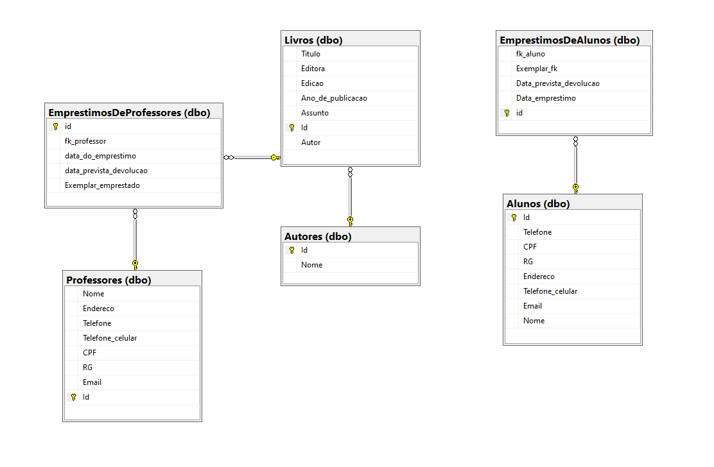

# API de biblioteca!📚
### índice
- Breve descrição;
- Como utilizar;
- O banco de dados
- Comentários finais

### Breve descrição
  Trata-se de uma simples API que gerencia informações do banco de dados de uma bilioteca, onde é possível cadastrar alunos, professores, livros (e seus autores) e também empréstimos de livros. 
 
 ### Como utilizar
 A API está hospedada no **Azure**, então é possível testá-la sem a necessidade de rodar na máquina de quem está testando. O link da API é https://bibliotecaapi20220103200847.azurewebsites.net/. A **documentação** está disponível em https://documenter.getpostman.com/view/18903968/UVXbuKYj. Basta utilizar algum software como o **Postman**(https://www.postman.com/) e fazer as requisições. 
 
 ### O banco de dados
  Eu desenvolvi essa API por conta de um exercício que fiz na disciplina de "Banco de dados", do meu curso de Ciência da Computação. Eu fiz o DER do banco, passei para o modelo lógico e, em seguida, criei as tabelas e colunas. O banco está rodando no mesmo grupo de recursos da API, no Azure
  

### Comentários finais
